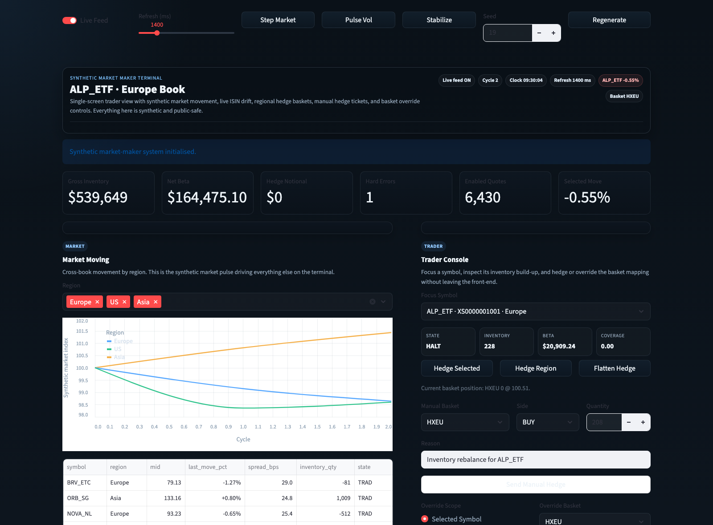

<div align="center">
  <h1>Synthetic Market Maker System</h1>
  <p><strong>A single-screen synthetic market-maker terminal with live ISIN movement, inventory drift, and hedge workflows.</strong></p>
  <p>Designed to feel closer to a trader front-end than a simple dashboard or buy/sell demo.</p>
</div>

<p align="center">
  <code>market moving</code>
  <code>isin changes</code>
  <code>inventory drift</code>
  <code>hedge console</code>
  <code>system UI</code>
  <code>public-safe synthetic data</code>
</p>

## Preview



## Overview

This repo is a synthetic trading workstation demo inspired by market-making workflows.

## Highlights

- a live `Market Moving` panel showing regional synthetic market motion
- an `ISIN Changes` panel showing selected symbol drift over time
- synthetic inventory drift from market-making flow
- symbol-level and region-level hedge actions
- a manual hedge ticket and basket override workflow
- dense terminal-style tables and event feeds around the trader workflow

## Why It Reads Like A Trading Terminal

This tells a more realistic story than a basic trading page because it shows:

- a monitored book, not just a trade form
- inventory building up over time
- hedge decisions made inside the same workstation
- system behavior that keeps moving while the trader reacts

## Main Surfaces

| Surface | Purpose |
| --- | --- |
| `Market Moving` | Top-left regional market motion driven by live synthetic history |
| `ISIN Changes` | Bottom-left selected symbol tape with price and inventory history |
| `Trader Console` | Hedge selected symbol or region, send a manual hedge ticket, and override basket mapping |
| `Regional Risk` | Hedge basket positions and region-level post-hedge exposure |
| `Live ISIN Board` | Dense table for the whole synthetic book, closer to a real front-end terminal |
| `cover.py` | Landing page for the repository preview image |

## Quick Start

```bash
python3 -m venv .venv
source .venv/bin/activate
pip install -r requirements.txt
streamlit run app.py
# optional screenshot / README cover
streamlit run cover.py
```

## Project Structure

```text
synthetic-trading-system/
├── app.py
├── cover.py
├── README.md
├── requirements.txt
└── src/
    ├── mm_system.py
    ├── quote_monitor.py
    ├── ui.py
    ├── engine.py
    ├── market.py
    ├── showcase.py
    └── __init__.py
```

## Notes

- All quotes, instruments, ISINs, venues, inventory, baskets, and incidents are synthetic.
- The goal is to demonstrate internal-tool and trader-workstation product design, not reproduce proprietary company logic.
- The live feed uses timed page refresh so the system feels active and continuously monitored.
- The app is intentionally single-page so it feels like a terminal, not a multi-page dashboard site.
